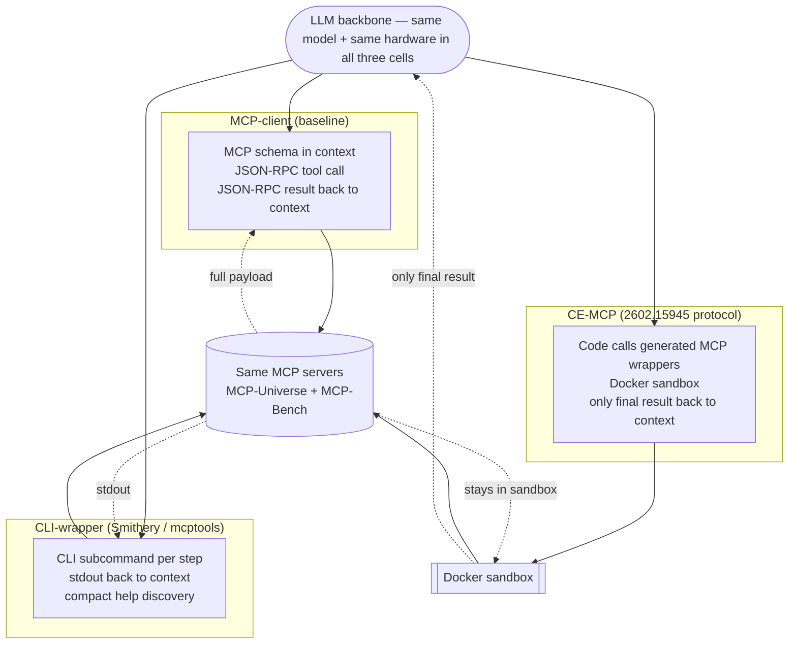
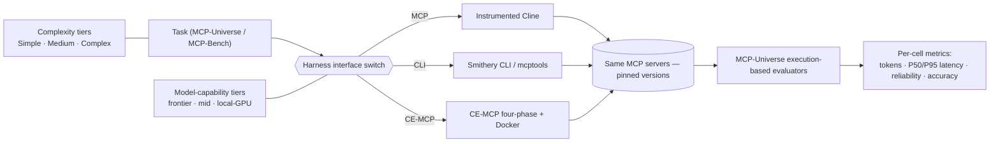

# Paper Draft (Review Version) — A Controlled Benchmark Comparison of MCP-Client, CLI-Wrapper, and Code-Execution-MCP Agents

> **Status:** review-version reframe of `references/paper-draft-2x2-tool-interface.md`. Original preserved.
> **Scope change:** 3 cells (MCP-client / CLI-wrapper / CE-MCP). CE-CLI dropped — see §3.4.
> **Framing change:** "first *controlled, peer-reviewed, benchmark-grounded* comparison," not a 2×2 decomposition or a novel-interface paper.
> **Corpus state:** 21 papers in `references/papers/`; threat papers ingested 2026-05-20: `2510.24563`, `2511.07426`, `2602.14878` (already had), `2602.20867`.

---

## Working Title

**Primary:**
> *Which Tool Interface Should Your Agent Use? A Controlled Benchmark of MCP-Client, CLI-Wrapper, and Code-Execution Agents on MCP-Universe*

**Alternatives:**
- *MCP-Client vs CLI-Wrapper vs Code-Execution: A Developer's Decision Benchmark*
- *Settling the MCP vs CLI Debate: A Controlled Three-Way Comparison on Real MCP Servers*

---

## Abstract

Industry gray literature reports that wrapping MCP servers as ergonomic CLIs cuts agent token consumption 10–35×, and that routing tool calls through sandboxed code achieves 98–99% context-token reductions — but these claims are uncontrolled, run on author-defined tasks, lack execution-based evaluation, and span no formal model-tier or task-complexity sweep. Despite an explosion of MCP measurement papers in 2025–2026 (MCP-Universe, MCP-Bench, MCP-AgentBench, MCP-Atlas, MCPToolBench++, LiveMCPBench, MCP-Flow, OSWorld-MCP, plus Ding et al.'s systematic MCP performance characterization), **no peer-reviewed paper has compared MCP-client agents against CLI-wrapper agents on a peer-reviewed benchmark with execution-based evaluators, statistical inference, and a model-tier sweep**. We extend two established MCP benchmarks (MCP-Universe primary, MCP-Bench secondary) with two additional agent paths — a CLI-wrapper agent driven by community-standard MCP→CLI tooling (Smithery CLI / `mcptools`), and a Code-Execution-MCP agent following the CE-MCP four-phase protocol — and run the first controlled three-way comparison across three model-capability tiers (frontier, mid, local-GPU) and three task-complexity tiers (simple 1–2 calls, medium 3–6, complex 7+). We report per-task token cost, P50/P95 latency, tool-call reliability, and execution-based task accuracy as a joint developer-decision matrix. The wrappers are commodity; the contribution is the measurement rig, the implementation-parity protocol that makes the comparison fair, the benchmark extension itself, and the resulting decision matrix.

---

## 1. Introduction

### 1.1 The MCP token-cost regime is now documented; the alternatives are not measured against it on common ground

The Model Context Protocol (MCP) standardizes how foundation-model agents talk to external tools. With that standardization comes a measured cost. Ding et al. (arXiv 2511.07426, the first systematic MCP measurement study) instrumented the open-source MCP Host **Cline** across 9 LLMs and reported that MCP-enabled tasks run with **completion-to-prompt ratios 2–30× lower than ordinary chat** — i.e. the regime is overwhelmingly prompt-heavy. Per-task totals are large in absolute terms too: Gemini 2.0 Flash averages 875,887 input tokens / 1,576 output tokens per task, and even a compact model like GPT-4o-mini consumes ≈90k tokens per task. OPENDEV (2603.05344) corroborates from production: eager MCP schema loading at startup consumed 40% of the context budget *before the first user message*, and raw tool outputs otherwise dominate 70–80% of context. Tool Attention (2604.21816) measures 47,312 tokens/turn under naïve full-schema MCP injection.

Two families of remedy circulate:

1. **Change the surface representation.** Replace verbose MCP JSON-RPC schemas with self-documenting CLI commands, or augment the descriptions themselves. The schema-side academic line includes MCP-Zero (2506.01056, 98.24% token reduction via active discovery while preserving accuracy on APIBank's 48-tool set), JSPLIT (2510.14537, taxonomy routing, >2 orders of magnitude input-token reduction), Tool Attention (2604.21816, 95% lazy-schema cut), and Hasan et al.'s "Smelly tool descriptions" (2602.14878, +5.85pp success from description augmentation but +67.46% steps — content quality is real but does not always pay). The CLI-wrapper side is *industrial*: Smithery CLI, `f/mcptools`, `chrishayuk/mcp-cli`, `posit-dev/mcptools`, and Ando's `llm-cli` (techRxiv 2026) all ship MCP-server-as-CLI tooling at production grade.

2. **Change where orchestration runs.** Route tool calls through sandboxed code so only the final result re-enters context. CodeAct (arXiv 2402.01030, ICML 2024) established code-as-action over JSON/text tool calling: +20pp success on M3ToolEval for GPT-4-1106 and ~30% fewer turns. CE-MCP (arXiv 2602.15945) ports this to MCP servers specifically with a four-phase workflow (discovery → code generation → sandbox execution → result return) and reports substantial token/turn/latency reductions vs direct MCP, with gains scaling with multi-server complexity. The Jiang et al. SoK on Agentic Skills (arXiv 2602.20867) already names both remedies as design patterns: "metadata-driven progressive disclosure" (surface side) and "executable-code skills" (orchestration side) — they are not new abstractions; they are taxonomized.

### 1.2 What gray literature has, and what it does not have

The MCP-vs-CLI comparison the gray literature reports is dense and consistent on direction, but loose on rigor:

| Source | Headline number | Benchmark | Methodology gaps |
|---|---|---|---|
| [Mornati blog (2025)](https://blog.mornati.net/the-future-of-agentic-tooling-mcp-servers-vs-cli-a-data-driven-comparison) | per-op + fixed-context + session formulas | author-created GitHub ops | token only (char-est); no latency / accuracy |
| [OnlyCLI "MCP Token Trap"](https://onlycli.github.io/OnlyCLI/blog/mcp-token-cost-benchmark/) | "MCP burns 35× more tokens than CLI" | author-created | one number, no breakdown |
| [scalekit "MCP vs CLI"](https://www.scalekit.com/blog/mcp-vs-cli-use) | CLI 100% / 1,365–8,750 tok ; MCP 72% / 32k–82k tok ; $3.20 vs $55.20/month | author-created | no formal stats; single model |
| [Microsoft TechCommunity "MCP vs mcp-cli"](https://techcommunity.microsoft.com/blog/azuredevcommunityblog/mcp-vs-mcp-cli-dynamic-tool-discovery-for-token-efficient-ai-agents/4494272) | dynamic-discovery token efficiency | unspecified | qualitative |
| AXI (gray) | 79K (CLI) vs 185K (MCP) tokens/task | author-created | no peer review |
| Smithery editorial ("MCP vs. CLI is the wrong fight") | qualitative | n/a | opinion |

The direction is consistent (CLI < MCP on tokens), but **none of these uses an established MCP research benchmark, execution-based evaluators, model-tier comparison, statistical inference, or formal latency measurement**. The peer-reviewed measurement work (Ding et al. 2511.07426) is *MCP-only*, with no CLI-wrapper arm.

### 1.3 The empirical gap

What is missing — and what this paper provides — is a single study that:

1. **Compares MCP-client, CLI-wrapper, and CE-MCP** as agent paths over the same underlying MCP servers and tasks.
2. Runs on **established peer-reviewed benchmarks** (MCP-Universe + MCP-Bench), not ad-hoc author-defined tasks.
3. Scores with **execution-based evaluators** (MCP-Universe's format/static/dynamic checks; not LLM-as-judge).
4. Sweeps **model-capability tiers** (frontier, mid, local-GPU) so the developer's decision is not anchored to one model.
5. Sweeps **task-complexity tiers** (1–2 / 3–6 / 7+ tool calls) so the decision is not anchored to one operating point.
6. Reports **per-cell token consumption (input/output/total), P50/P95 latency, tool-call reliability, and task accuracy** jointly so the decision is not anchored to one metric.
7. Uses **community-standard wrappers** (Smithery CLI / `mcptools` for the CLI surface; CE-MCP per the 2602.15945 protocol) so the comparison is not biased by bespoke implementations.

### 1.4 Contributions

- **C1 — Benchmark extension + measurement rig.** We extend MCP-Universe (and MCP-Bench) with two additional agent paths over the *same MCP servers and tasks*: a CLI-wrapper agent (Smithery CLI / `mcptools`) and a CE-MCP agent (per the 2602.15945 four-phase protocol). The harness is built on the instrumented Cline used by Ding et al. (2511.07426) so absolute numbers are comparable to the anchoring MCP-only baseline. **The MCP→CLI wrappers themselves are commodity (Smithery, `mcptools`, `chrishayuk/mcp-cli`, Ando `llm-cli`, etc.) and we explicitly do not claim novelty on them**; the contribution is the measurement rig, the per-cell instrumentation, and the implementation-parity protocol (§5.6).
- **C2 — First controlled three-way comparison.** First peer-reviewed measurement of MCP-client vs CLI-wrapper vs CE-MCP on a peer-reviewed MCP benchmark with execution-based evaluators, formal statistical inference, three model-capability tiers, and three task-complexity tiers.
- **C3 — Developer decision matrix.** A joint (tokens × latency × reliability × accuracy) × (interface × model-tier × complexity) table that lets a developer pick the integration strategy for their actual operating point, validating or refuting the gray-lit headline numbers (10–35×, 100% vs 72% reliability, $3.20 vs $55.20) under controlled conditions.

### 1.5 Roadmap

§2 places this work in three threads of related literature: MCP measurement (academic + gray), MCP→CLI wrapper artifacts, and code-execution-with-tools. §3 defines the three agent paths and justifies excluding CE-CLI as a separate cell. §4 states research questions and grounded hypotheses. §5 specifies the experimental design at the level the paper itself needs; the full protocol lives in `references/review/experiment.md`. §6 covers threats to validity. §7 sketches future work (including the CE-CLI study the discussion left on the table). §8 lists the corpus.

---

## 2. Related Work

### 2.1 MCP measurement (academic)

- **Ding, Zhu, Liu (2511.07426)** — first systematic MCP measurement study; 9 LLMs × 3 servers × 8 tasks via instrumented Cline. Documents the prompt-heavy regime (C/P 2–30× vs general chat), the serial multi-tool bottleneck, and the error-loop token-growth pathology. MCP-only; our anchoring baseline.
- **MCP-Universe (2508.14704)** — 231-task real-server benchmark with execution-based evaluators (format/static/dynamic). Even GPT-5 reaches only 43.72% SR. **Our primary benchmark.**
- **MCP-Bench (2508.20453)** — 28 MCP servers, 250 tools, multi-faceted evaluation. Used by CE-MCP. **Our secondary benchmark** (especially for the CE-MCP replication cell).
- **MCP-AgentBench (AAAI 40347), MCPAgentBench (2512.24565), MCP-Atlas (2602.00933), MCPToolBench++ (2508.07575), LiveMCPBench (2508.01780), MCP-Flow (2510.24284), MCP-R1, MCP Company (2510.19286), MCPVerse (2508.16260)** — the 2025–2026 MCP benchmark wave. All are MCP-only. Several measure tokens; none introduces a CLI or CE arm.
- **OSWorld-MCP (2510.24563)** — MCP-vs-GUI in computer-use multimodal agents. Different axis (modality, not surface representation); adjacent but does not occupy this gap.

### 2.2 MCP→CLI wrappers (commodity)

The MCP-to-CLI bridging layer is mature production tooling, not a research contribution:

- **Smithery CLI** ([github.com/smithery-ai/cli](https://github.com/smithery-ai/cli)) — production registry + `smithery tool call <conn> <tool> [args]` CLI surface over installed MCP servers.
- **f/mcptools** ([github.com/f/mcptools](https://github.com/f/mcptools)) — Go CLI, stdio + HTTP + streamable HTTP transports.
- **chrishayuk/mcp-cli** ([github.com/chrishayuk/mcp-cli](https://github.com/chrishayuk/mcp-cli)) — IBM-affiliated Python CLI host.
- **posit-dev/mcptools** ([posit-dev.github.io/mcptools](https://posit-dev.github.io/mcptools/)) — R/data-science MCP CLI.
- **Ando, "Secure-by-Default Guardrails for MCP-Based Tool Use" (techRxiv 2026)** — academic write-up of `llm-cli`, a unified CLI wrapping MCP tools with RSA workload identity, RBAC, and dynamic intent verification. Security paper, not a token/accuracy study, but proves the artifact category is *also* present in the academic literature.

This paper uses Smithery CLI / `mcptools` as the CLI surface to remove any "the authors hand-tuned their bespoke CLI" objection. Any C1 sentence that reads as "we built a new MCP→CLI adapter" would be a false claim.

### 2.3 Code-as-action and code-execution-with-MCP

- **CodeAct (2402.01030)** — foundational result: code-as-action beats JSON/text tool calling by up to +20pp success across 17 LLMs, with ~30% fewer turns. Crucially, the advantage is *complexity-gated* (on atomic single-call tasks, JSON beats CodeAct for strong models) and *capability-dependent* (the advantage widens with backbone strength). Both findings predict where CE-MCP wins and loses in our sweep.
- **CE-MCP (2602.15945)** — code-as-action instantiated on MCP servers: post-query lazy discovery → code generation → sandbox execution → result return. Reports substantial token / turn / latency reductions vs direct MCP on MCP-Bench across GPT-family models, with gains scaling with multi-server complexity. Also documents 16 new attack classes specific to CE-MCP (sandbox security). Our CE-MCP cell follows this protocol.

### 2.4 Surface-side remedies (within-MCP)

- **MCP-Zero (2506.01056)** — agent-driven active tool discovery; 98.24% token reduction, accuracy preserved.
- **JSPLIT (2510.14537)** — taxonomy routing; >2 OOM input-token cut.
- **Tool Attention (2604.21816)** — lazy schema loading; 95% per-turn cut. *Simulation only on success/latency.*
- **Hasan et al., "Smelly tool descriptions" (2602.14878)** — within-MCP description augmentation; +5.85pp success, +67.46% steps. Closest academic analog to varying the MCP surface (varies *content quality* rather than *representation*).
- **OPENDEV (2603.05344)** — production CLI coding agent engineering ground truth: lazy MCP loading 40% → <5% of context budget, dual-agent safety, planner/executor separation.

### 2.5 Skill abstractions

- **Anthropic Agent Skills + Jiang et al. SoK (2602.20867)** — formalizes "agentic skills" as `S=(C, π, T, R)` and presents a 7-pattern × representation×scope taxonomy. **The two axes this paper varies are already named patterns there** ("metadata-driven progressive disclosure" + "executable-code skills"), which is why our C2 claim is reframed as *measurement first*, not *concept first*. SkillsBench evidence: curated skills +16.2pp; self-generated skills −1.3pp — direct risk for any CE-MCP cell where the model writes code at runtime; motivates our implementation-faithfulness protocol (§5.6).

### 2.6 Gray-literature MCP-vs-CLI benchmarks (what we test rigorously)

[Mornati (GitHub `gh` CLI vs `github-mcp-server` vs `nexus-dev`)](https://blog.mornati.net/the-future-of-agentic-tooling-mcp-servers-vs-cli-a-data-driven-comparison), [OnlyCLI ("35× more tokens")](https://onlycli.github.io/OnlyCLI/blog/mcp-token-cost-benchmark/), [scalekit (100% vs 72% reliability; $3.20 vs $55.20/month)](https://www.scalekit.com/blog/mcp-vs-cli-use), [Microsoft TechCommunity "MCP vs mcp-cli"](https://techcommunity.microsoft.com/blog/azuredevcommunityblog/mcp-vs-mcp-cli-dynamic-tool-discovery-for-token-efficient-ai-agents/4494272), [firecrawl](https://www.firecrawl.dev/blog/mcp-vs-cli), [Substack](https://manveerc.substack.com/p/mcp-vs-cli-ai-agents), [dev.to](https://dev.to/girma35/cli-agent-vs-mcp-a-practical-comparison-for-students-startups-and-developers-4com), [AXI](https://axi.md), [Smithery editorial "MCP vs CLI is the wrong fight"](https://smithery.ai). All consistent in direction (CLI < MCP on tokens), all on author-created tasks, none with formal statistics. **These are the claims under test in this paper, not citations of established fact.**

### 2.7 Adjacent comparison benchmarks (not occupying the gap)

- **MCPWorld (2506.07672)** — MCP vs API vs GUI vs hybrid in computer-use.
- **OSWorld-MCP (2510.24563)** — MCP vs GUI in computer-use (above).
- **Agent-Diff (2602.11224)** — agentic-LLM eval on enterprise APIs via code execution + state-diff scoring. No CLI-wrapper arm.

---

## 3. Three Agent-Tool Integration Strategies

### 3.1 MCP-client (baseline)

Standard MCP Host pattern (e.g., Cline): tool schemas + interaction history + system prompt injected into context every turn; the model emits a tool call; JSON-RPC result returns to context; repeat. The dominant deployed pattern and the only arm in MCP-Universe and Ding et al. (2511.07426).

### 3.2 CLI-wrapper

The same MCP servers exposed as CLI commands via community-standard tooling (Smithery CLI: `smithery tool call <conn> <tool> [args]`; `mcptools`: `mcp tools call ...`). The agent issues a single CLI command per ReAct turn; stdout returns to context. Discovery via `tool list` and `tool describe` (analogous to MCP schema injection but more compact in token form). This is the configuration the gray-lit benchmarks claim is 10–35× cheaper than direct MCP.

### 3.3 CE-MCP

Following the four-phase CE-MCP protocol of Felendler et al. (2602.15945): (1) post-query lazy tool discovery; (2) the model writes a single Python program that imports generated wrappers for the selected MCP tools and orchestrates them; (3) execution in a Docker sandbox; (4) only the final result returns to model context, with regenerate-on-failure as the recovery loop.

### 3.4 Why CE-CLI is not a fourth cell (and is deferred)

An earlier version of this draft included a fourth cell — CE-CLI, an agent writing sandboxed scripts that shell out to CLI tools. Two arguments against treating it as a separate measurement cell in this paper:

1. **The CLI row is a granularity continuum, not two categorical cells.** Once the agent has shell access, "in-context CLI" (one command per ReAct turn) and "CE-CLI" (a script with N commands) differ only in how many commands are batched before returning to context. There is no architectural switch; it is a parser-enforced policy that this study would have to *impose* on the in-context CLI cell, which would itself be an experimental decision rather than a natural property.
2. **Discovery cannot be hidden in a sandbox.** A central CE-MCP saving is keeping tool schemas out of model context; the corresponding CLI claim would be reading `tool --help` *inside the sandbox*. But `--help` output is needed *by the model* to choose arguments — discovery is inherently iterative and must surface to context, just as MCP-Zero's active-discovery output does. So CE-CLI and CE-MCP would differ only by the (small, non-scaling) representation delta between an MCP JSON schema and CLI help text — likely below the measurement floor.

We therefore drop CE-CLI as a cell here, but record the analysis as future work (§7) and note that the *insight* — that the orchestration-locus axis is real on MCP and degenerate on CLI — is itself a finding of the present paper.

---

## 4. Research Questions & Hypotheses

**RQ1 (surface — headline).** Holding model, tasks, and infrastructure fixed, how does the CLI-wrapper agent compare to the MCP-client agent on total tokens, latency, tool-call reliability, and execution-based task accuracy? Do the gray-lit headline numbers (10–35× tokens; 100% vs 72% reliability) survive on MCP-Universe with execution-based evaluators?

**RQ2 (orchestration).** Holding the MCP surface fixed, how does the CE-MCP agent (per 2602.15945 protocol) compare to the MCP-client agent on the same four metrics? Does the CE-MCP token saving reported in 2602.15945 (GPT-only, MCP-Bench) replicate on MCP-Universe and across model tiers?

**RQ3 (model-capability moderation).** How does the three-way ranking shift across three model-capability tiers (frontier: Claude Opus 4.x / GPT-5; mid: Haiku 4.5 / GPT-4o-mini / Llama-3.3-70B; local-GPU: Gemma 3 4B / Qwen2.5-Coder-7B)? Where is the capability threshold below which CE-MCP becomes counterproductive because the model cannot reliably emit runnable code?

**RQ4 (task-complexity moderation).** How does the ranking shift across three task-complexity tiers (Simple 1–2 calls / Medium 3–6 / Complex 7+) drawn from MCP-Universe's step distribution? Where does the CE-MCP advantage emerge and where does it fail (per CE-MCP's own three-server findings)?

**Hypotheses.**

- **H1 (CLI surface).** CLI-wrapper reduces input tokens vs MCP-client because the per-turn schema injection cost is lower (CLI help vs MCP JSON-RPC schema). Effect direction matches gray lit; magnitude likely smaller than the 10–35× headlines under MCP-Universe's heavier real-server interactions. Latency: CLI-wrapper slightly higher per call (subprocess spin-up) but lower in cumulative time because of fewer turns. Reliability: comparable on frontier; CLI may be more reliable on weaker models because shell-priors are stronger than MCP-protocol priors.
- **H2 (CE-MCP).** CE-MCP reduces total tokens vs MCP-client; gain scales with chain depth / fan-out / payload size (consistent with CodeAct 2402.01030 and CE-MCP 2602.15945). P95 latency higher than P50 due to write-run-debug iterations. Accuracy comparable on frontier; degrades on iterative/adaptive tasks (Wikipedia/Reddit-style), per CE-MCP's own findings.
- **H3 (capability moderation).** CE-MCP advantage widens with model strength (CodeAct's "advantage widens with backbone strength" finding). On the local-GPU tier, CE-MCP collapses to <50% of frontier accuracy as code-generation reliability falls. CLI-wrapper is the *robust* choice on weak models (shell priors > JSON-RPC priors > arbitrary code generation).
- **H4 (complexity moderation).** All three cells are statistically indistinguishable on Simple tasks (1–2 calls — manipulation tier). On Complex tasks (7+ calls), CE-MCP shows the largest token reduction but CLI-wrapper shows the most reliable token reduction (lower variance). MCP-client wins on iterative tasks where incremental retry is essential.

---

## 5. Experimental Design (high-level)

The full protocol lives in `references/review/experiment.md`. This section gives the level the paper text needs.

### 5.1 Harness

- **MCP-client cell:** instrumented Cline v3.14.0 (forked from Ding et al. 2511.07426 release) so our absolute numbers are directly comparable to theirs. OpenRouter as model gateway.
- **CLI-wrapper cell:** Smithery CLI as primary, `f/mcptools` as cross-check; same OpenRouter gateway; same task set.
- **CE-MCP cell:** four-phase protocol from 2602.15945; generated Python wrappers around each MCP tool; Docker sandbox with resource limits.
- **Identical for all three cells:** model, task, MCP server versions, OpenRouter gateway, hardware, temperature=0, step budget, retry policy.

### 5.2 Benchmarks

- **MCP-Universe (primary, 2508.14704).** 231 tasks, 11 real MCP servers, execution-based evaluators (format/static/dynamic). Three complexity tiers derived post-hoc by observed step count.
- **MCP-Bench (secondary, 2508.20453).** Used for CE-MCP replication and as a denser complex-task tier if MCP-Universe's 7+ bucket is thin.

### 5.3 Model-capability tiers

- **Frontier:** Claude Opus 4.x (primary), GPT-5.x (replication).
- **Mid:** Claude Haiku 4.5, GPT-4o-mini, Llama-3.3-70B (open-weight, runnable locally).
- **Local-GPU:** Gemma 3 4B, Qwen2.5-Coder-7B (small generative; code-capable comparison).

### 5.4 Task-complexity tiers

Simple (1–2 calls), Medium (3–6), Complex (7+ multi-hop). Stratified post-hoc by observed step count on MCP-Universe, validated against MCP-Bench's single/two/three-server tags.

### 5.5 Metrics

- **Tokens:** input / output / total per task; API-reported, cross-checked with `tiktoken` cl100k_base.
- **Latency:** wall-clock per task incl. subprocess / sandbox spin-up; P50 and P95.
- **Tool-call reliability:** per-call outcome `ok | schema/parse-error | execution-error | wrong-tool | sandbox-fail | timeout`; success rate = `ok / total`. Plus write-run-debug iteration count for CE-MCP.
- **Task accuracy:** binary, execution-based (MCP-Universe evaluators); never LLM-as-judge.

### 5.6 Implementation-parity protocol (first-class)

Because this is a black-box three-way comparison (not a clean factorial), the result is only as fair as the *weakest implemented cell*. Hence:

1. **All three cells use community-standard tooling.** No bespoke adapters. Cline (MCP), Smithery CLI / `mcptools` (CLI), CE-MCP-2602.15945-protocol (CE-MCP).
2. **Same model and hardware for every run.** OpenRouter as the model gateway; one hardware tier per experiment session.
3. **Same task set per benchmark.** No per-cell task curation.
4. **Same step budget, retry policy, and timeout** across all three cells.
5. **Discovery strategy held constant.** All three cells use lazy / on-demand discovery (MCP-Zero-style for MCP and CE-MCP; `tool list` + `tool describe` for CLI), so the comparison is between operational regimes, not between "eager MCP" and "lazy CLI" — that would be a strawman.
6. **Manipulation check.** A Tier-0 task (single trivial call with a tiny payload) that *must* yield indistinguishable token costs across all three cells; if it does not, the harness has a bias to fix before any real run.
7. **Pre-registered code-generation prompts and few-shots for CE-MCP.** SkillsBench evidence (Jiang et al. 2602.20867) shows that *curated* code-as-skill artifacts raise success by 16.2pp while *self-generated* ones regress 1.3pp. We commit our CE-MCP prompting and wrapper templates in advance so the CE-MCP arm reflects a credible engineering effort, not an undertuned strawman.
8. **Documented prompt translation between MCP and CLI surfaces.** Minimal, mechanical, and reviewed; no per-task tuning.

### 5.7 Conditions & cost (focused core)

3 cells × 3 model tiers × ~60 balanced tasks × 3 repeats ≈ 1,620 runs for Experiment 1 (balanced); + 3 × 3 × 60 × 3 ≈ 1,620 runs for Experiment 2 (complexity-stratified). Total ≈ 3,240 runs. Estimated API cost ~$2k–4k (local-GPU runs near-free on owned hardware).

---

## 6. Threats to Validity

| Threat | Mitigation |
|---|---|
| Black-box comparison validity depends on weakest cell implementation | §5.6 implementation-parity protocol with community-standard tooling for every cell |
| CE-MCP arm under-implemented relative to CLI / MCP | Pre-registered prompts/templates per the SoK 2602.20867 / SkillsBench evidence; reproduce CE-MCP-2602.15945's reported numbers as a sanity check on MCP-Bench replication |
| MCP-Universe live-evaluator non-replayability (Google Maps, GitHub, Yahoo Finance, Playwright) | Pin server versions, temperature=0, document API-key state; cache static-evaluator outcomes; budget ~$50–200 per 1k-run batch |
| Model-tier choice may bias results toward CLI (better shell priors) | RQ3 *is* this effect; we report it explicitly, do not control it away |
| Complexity-tier split (1–2 / 3–6 / 7+) is post-hoc | Stratify by observed step count *after* the MCP-client run; sample balanced across tiers; document the split decision before any final-run analysis |
| Single-tier hardware does not capture inference-server variation | Out of scope; we hold hardware fixed and treat latency as a within-run measurement |
| LLM-as-judge fluency bias | Avoided entirely; MCP-Universe execution-based evaluators only |
| Generalization to MCP servers not in MCP-Universe / MCP-Bench | Reported as a limitation; future work explicitly addresses synthetic-server sweep |
| Scoop risk (8+ gray-lit benchmarks; new academic benchmarks every quarter) | Lead with RQ3 (capability threshold) which is least scoopable; release artifacts on acceptance to claim priority |

---

## 7. Future Work

- **CE-CLI as its own study (§3.4 deferred).** Test whether allowing sandbox-side `--help` parsing *programmatically* (without surfacing to model context) can recover any real saving over CE-MCP. Predicted result: small, non-scaling delta; null is informative.
- **Synthetic-server generator** with controlled chain-depth, fan-out, payload-size knobs, retaining the implementation-parity protocol — to cleanly isolate where the CE-MCP advantage saturates.
- **Multi-agent extension.** Hold the agent architecture (orchestrator–workers, planner–executor–validator) fixed and vary the worker-side tool interface across our three cells, per the CodeAgents (2507.03254) and Stop Wasting Your Tokens / SMAS (2510.26585) blueprints.

---

## 8. References — Corpus

The reframed corpus (21 PDFs in `references/papers/`, indexed in `INDEX.md`):

**Anchoring measurement / benchmark:** MCP-Universe (2508.14704), MCP-Bench (2508.20453), Ding et al. (2511.07426).
**Code-as-action lineage:** CodeAct (2402.01030), CE-MCP (2602.15945).
**Surface-side remedies:** MCP-Zero (2506.01056), JSPLIT (2510.14537), Tool Attention (2604.21816), Hasan et al. "Smelly" (2602.14878), SkillReducer (2603.29919), ToolScope (2510.20036), Schema First (2603.13404).
**Production CLI ground truth:** OPENDEV (2603.05344).
**Adjacent benchmarks:** OSWorld-MCP (2510.24563), MCPVerse (2508.16260), MCPAgentBench (2512.24565).
**Multi-agent context:** SMAS (2510.26585), Efficient Agents (2508.02694), AgentDiet (2509.23586), Separating Intelligence from Execution (2605.00827).
**Taxonomy / SoK:** Jiang et al. "SoK: Agentic Skills" (2602.20867).
**Gray-literature targets (to validate):** Mornati, OnlyCLI, scalekit, Microsoft TechCommunity, firecrawl, Substack, dev.to, AXI, Smithery editorial.
**Wrapper artifacts (commodity, cited not measured against):** Smithery CLI, `f/mcptools`, `chrishayuk/mcp-cli`, `posit-dev/mcptools`, Ando `llm-cli` (techRxiv 2026).

---

## Appendix A — Three Strategies (data flow)

## Appendix B — Benchmark Extension (interface switch)

